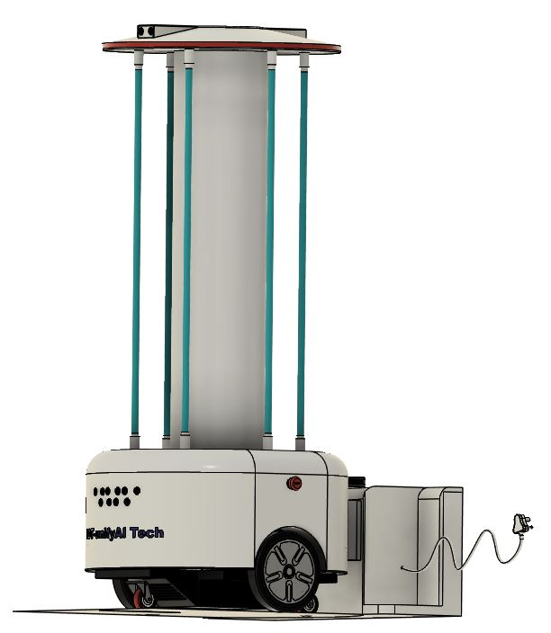
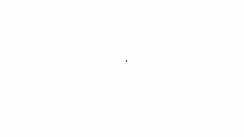

# UV-sterilization-bot

 

This repo showcase the firmware of a modular semi-autonomous UV sterilization bot built using ESP32. It also contains the simulation scenes from Coppeliasim and Arduino code which was used to mimic encoders feedback, due to the unavailability of the hardware setup. The project is owned by [IOT-unifyAI Tech](https://www.linkedin.com/company/iot-unifyai-tech/about/) a budding startup and was developed by multiple people working on different aspect of the code. 

---
---
---
## Description

The aim of building the robot was to develop a low-cost modular autonomous differential drive bot that can be used for various applications by switching the attachment on the bot, UV lamp is used in the present case for sterilization of the hospital ward and ICUs. The autonomous functionality was kept limited to keep the components and cost to a minimum. ESP32 is selected as the main controller because of its cost, speed, and dual-core architecture. In addition, it features an inbuilt wifi module for running the webserver. [ESP-IDF framework](https://github.com/espressif/esp-idf) is used as the main software for developing the embedded firmware. 

As we are all experiencing a once in a century covid-19 pandemic, It's important we build technologies that help reduce the virus spread in open/closed spaces. This project is one step in that direction and we are hoping to see open community collaboration around this project, Hence we open source the project and documentation. Note that the current development is limited to testing on mini-bot, the final prototype development and testing is still in progress. Relevant updates will be posted here. Stay safe and Enjoy innovating....Cheers!     

Feel free to reach us out email: raj@iot-unifyai-tech.com or open an "issue". We'll try to get back to you at the earliest!  

### There is another version of the same project developed with minor code changes like data storage, path reversal but offers same functionality. Ref: [Second version](https://github.com/tech-igloo/UV-sterilization-bot-version2).

Refer to the [wiki](https://github.com/tech-igloo/Semi-autonomous-UV-sterilization-bot/wiki) or [Main detailed document](https://docs.google.com/document/d/1RLSxYpE-qpH-aJCvkTX2Nx5258DcZrUb-oL_mETsY1s/edit?usp=sharing) for development process and philosopy behind the design. 

## Hardware

The main components of the bot are BLDC Hub motors for differential drive, encoders for localization using dead reckoning, Ultrasonic sensors for obstacle avoidance while in autonomous mode, and ESP32 as the main microcontroller running the web server for remote control and operation, storage of network credentials and recorded paths using SPIFFS file system, as well as sensing and actuation using GPIO.

## Coppeliasim

Prior to developing the code for ESP32, the autonomous navigation algorithm for traversing in a 2D coordinate system was tested in the coppelia sim environment. Along with that obstacle avoidance functionality and all the possible fail cases were determined with various placement of obstacles.

## Arduino

In the intermediate stages of development due to remote work and lack of availability of hardware, a arduino code was build for unit testing of code. The Arduino program produced square wave at regular intervals, the period of which could be set using the serial monitor to minic encoder feedback with speed depending upon the delay provided. This helped in validating the components of the autonomous and docking algorithm.

## Design and Demo

 

>>Add demo video

##aravind

